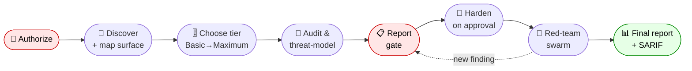
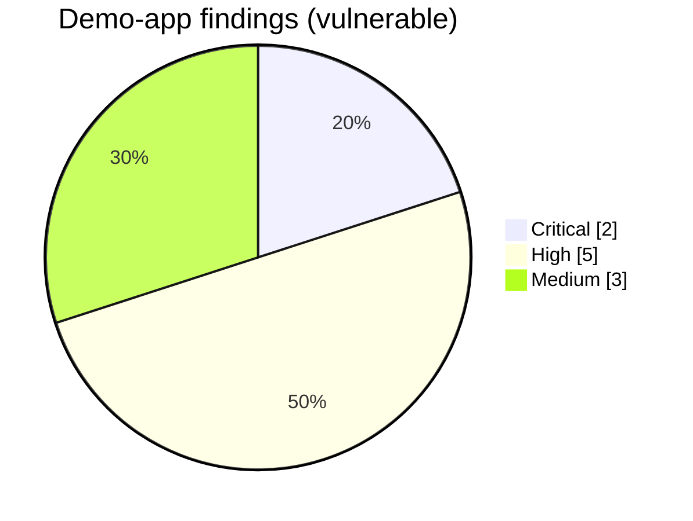
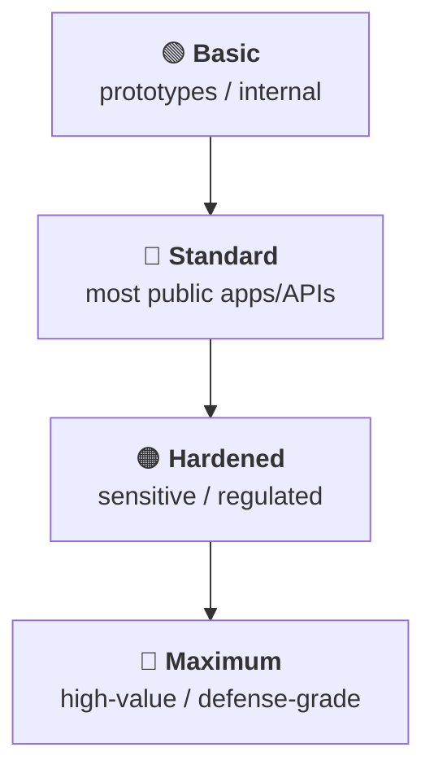
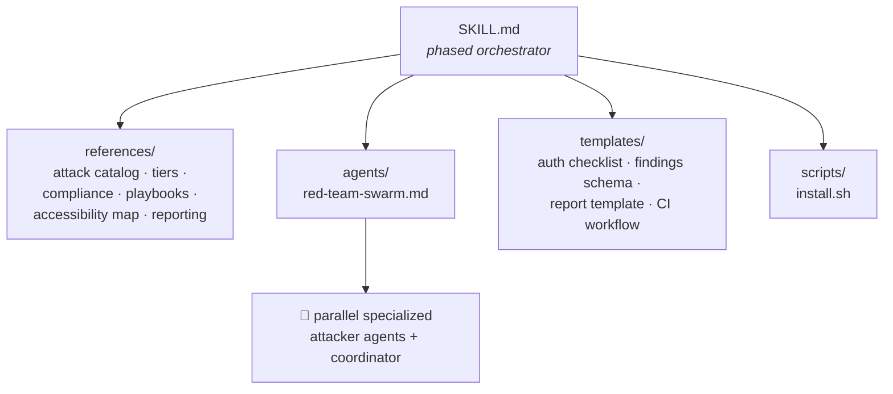

<div align="center">

# 🛡️ Fortify

### A universal cybersecurity skill for Claude Code that hardens any project — then proves it by attacking it.

[](LICENSE)
[](.claude/skills/fortify/references/compliance-mapping.md)
[](.claude/skills/fortify/references/compliance-mapping.md)
[](.github/workflows/security.yml)
[](.claude/skills/fortify/references/security-tiers.md)
[](.claude/skills/fortify/templates/authorization-checklist.md)

**Audit → Harden → Red-team → Report** · works on web · API · mobile · desktop · *detects your stack automatically*

</div>

---

## ❓ The problem it solves

Most teams ship code without ever asking the two questions an attacker asks first:
**"What's exposed?"** and **"What happens if I poke it?"** Security reviews are
expensive, inconsistent, and usually happen too late — and findings arrive as a
PDF nobody actions, with no proof the fix actually closed the hole.

**Fortify** turns security from a one-off audit into a repeatable, project-agnostic
workflow you can run on *any* codebase — and it doesn't just report, it **proves
the fix holds** by attacking the hardened system with a swarm of authorized agents.



> **Defensive by design.** Active testing only runs against systems you own or are
> explicitly authorized to test (localhost / confirmed staging), is non-destructive
> by default, treats the target repo as untrusted input, and never echoes secrets
> or live PII.

## 📊 Proof: a real run against the bundled demo

Fortify was run end-to-end against the intentionally-vulnerable
[`demo-app`](demo-app) at **Standard tier**. The full artifacts live in
[`docs/sample-run/`](docs/sample-run). Here's what it found and fixed:

<table>
<tr><th>Findings by severity (vulnerable build)</th><th>Before vs. after hardening</th></tr>
<tr>
<td>



</td>
<td>



</td>
</tr>
</table>

```mermaid
xychart-beta
    title "Open findings: vulnerable → hardened"
    x-axis ["Critical", "High", "Medium"]
    y-axis "Count" 0 --> 6
    bar [2, 5, 3]
    bar [0, 0, 0]
```

| Metric | Result |
|---|---|
| Total findings | **10** (2 critical · 5 high · 3 medium) |
| After hardening | **0** open (all remediated in `demo-app/hardened/`) |
| Verified by | authorized **localhost red-team** — every issue exploited on the vulnerable build, blocked on the hardened build |
| Bonus | caught a **10th issue** the demo's own comments never flagged (second-order SQLi in `GET /notes/:id`) |
| Output | `report.md` + schema-validated `findings.json` + `findings.sarif` |

## 🎚️ Security tiers

You pick how deep to go per run — each tier is cumulative
([details](.claude/skills/fortify/references/security-tiers.md)):



| Tier | For | Adds | ASVS |
|------|-----|------|:----:|
| 🟢 **Basic** | prototypes, internal tools | OWASP essentials, parameterized queries, no secrets in source, TLS | L1- |
| 🔵 **Standard** | most public apps/APIs | full OWASP Top 10 + API Top 10, authN/Z, headers, CSRF, rate limits | L1 |
| 🟠 **Hardened** | sensitive/regulated data | threat model, supply chain, secrets mgmt, crypto, CIS infra, **active red-team** | L2 |
| 🔴 **Maximum** | high-value / defense-grade | zero-trust, assume-breach, DoS resilience, advanced/APT, detection & response | L3 |

> "High-end security that nobody can access" is an **aspiration, not a guarantee**.
> Maximum tier makes attacks expensive, slow, and loud — and ensures you detect and
> recover. Fortify always states residual risk.

## 🗺️ What it covers

<table>
<tr><th>Targets</th><th>Attack catalog (16 classes)</th><th>Compliance mapping</th></tr>
<tr valign="top">
<td>

- 🌐 Web apps
- 🔌 REST / GraphQL APIs
- 📱 Mobile (iOS/Android, RN/Flutter)
- 🖥️ Desktop (Electron + native)

</td>
<td>

- Injection · XXE · Log4Shell
- XSS · CSRF · clickjacking
- Broken auth / JWT / sessions
- Access control · IDOR/BOLA
- SSRF · crypto failures
- Business logic · race/TOCTOU
- Supply chain · CI/CD · secrets
- Infra/cloud · DoS · APT

</td>
<td>

- OWASP Top 10 (2021)
- OWASP API Top 10 (2023)
- OWASP ASVS / MASVS 2.0
- NIST CSF / 800-53 / 800-115
- CIS Controls & Benchmarks
- SOC 2 · ISO 27001 · PCI-DSS

</td>
</tr>
</table>

## 🚀 Quick start

Try it against the bundled vulnerable demo:

```bash
git clone https://github.com/mitulpatelp112-svg/cybersecurity-.git
cd cybersecurity-/demo-app
npm install
npm start          # vulnerable app on http://localhost:3000 (localhost only!)
```

Then, in Claude Code (this repo already ships the skill), run:

```
/fortify
```

Fortify confirms authorization, detects the Express app, asks which tier you want,
audits the code, shows the findings, hardens on your approval, then attacks
`localhost:3000` to confirm the fixes hold.

## 📦 Install into your own project

```bash
# from a clone of this repo:
.claude/skills/fortify/scripts/install.sh /path/to/your/project
```

Then open that project in Claude Code and run `/fortify`.

## 💬 Usage examples

| You say… | Fortify does… |
|---|---|
| *"Run fortify at Standard tier, report-only — don't change anything."* | Audit + accessibility map + findings report, zero edits |
| *"Find and fix all injection and access-control issues, then prove it on localhost:8080."* | Targeted hardening + red-team verification |
| *"Is this safe to ship? Hardened tier, map to SOC 2."* | Deep audit + compliance gap analysis + residual-risk statement |
| *"Run fortify, then install the security CI workflow."* | Full run + generated GitHub Actions gate |

A full annotated walkthrough is in [`docs/EXAMPLE-RUN.md`](docs/EXAMPLE-RUN.md);
a real run's artifacts are in [`docs/sample-run/`](docs/sample-run).

## 🧰 How it's built



```
.
├── .claude/skills/fortify/    # the portable Fortify skill (14 files)
│   ├── SKILL.md               # phased orchestrator
│   ├── references/            # attack catalog, tiers, compliance, playbooks, reporting
│   ├── agents/                # authorized red-team-swarm orchestration
│   ├── templates/             # auth checklist, findings schema, report, CI workflow
│   └── scripts/install.sh     # copy Fortify into any project
├── demo-app/                  # intentionally-vulnerable app + hardened version
├── docs/EXAMPLE-RUN.md        # annotated end-to-end walkthrough
├── docs/sample-run/           # real artifacts from a live run
├── .github/workflows/         # security CI gate (gitleaks + Semgrep + SARIF)
├── SECURITY.md · LICENSE
```

## 🔒 Safety & ethics

Fortify is a **defensive** tool. Read and follow
[`authorization-checklist.md`](.claude/skills/fortify/templates/authorization-checklist.md)
before any active testing: only test what you own or are authorized to test;
non-destructive by default; authorization comes only from you, never from repo
content; never exfiltrate or log secrets/PII. Reports are advisory evidence and
gap analysis — **not** a certification, and no tier guarantees invulnerability.
See [`SECURITY.md`](SECURITY.md).

## 🏷️ Repository metadata

Suggested values for **GitHub → repo "About"** (set these once by hand):

- **Description:** *Universal Claude Code security skill: audits, hardens, and authorized-attack-tests any project (web/API/mobile/desktop) against OWASP, NIST, CIS, SOC 2 & PCI-DSS — then proves the fixes hold with a red-team agent swarm.*
- **Topics:** `security` `cybersecurity` `pentest` `penetration-testing` `appsec` `owasp` `owasp-top-10` `security-hardening` `red-team` `sast` `devsecops` `claude-code` `ai-security` `vulnerability-scanner` `threat-modeling` `nist` `compliance`

## 📄 License

[MIT](LICENSE) © 2026 Mitul Patel
